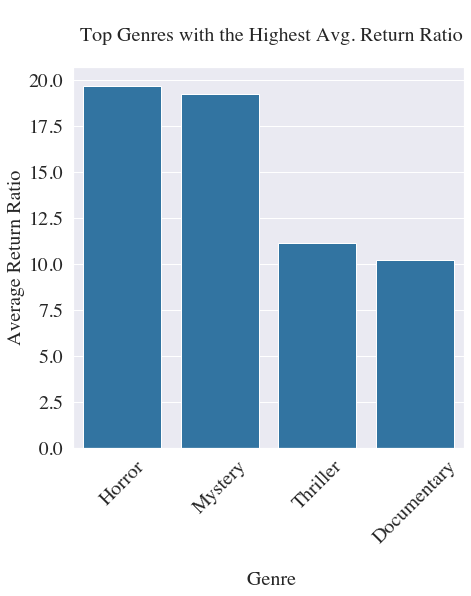
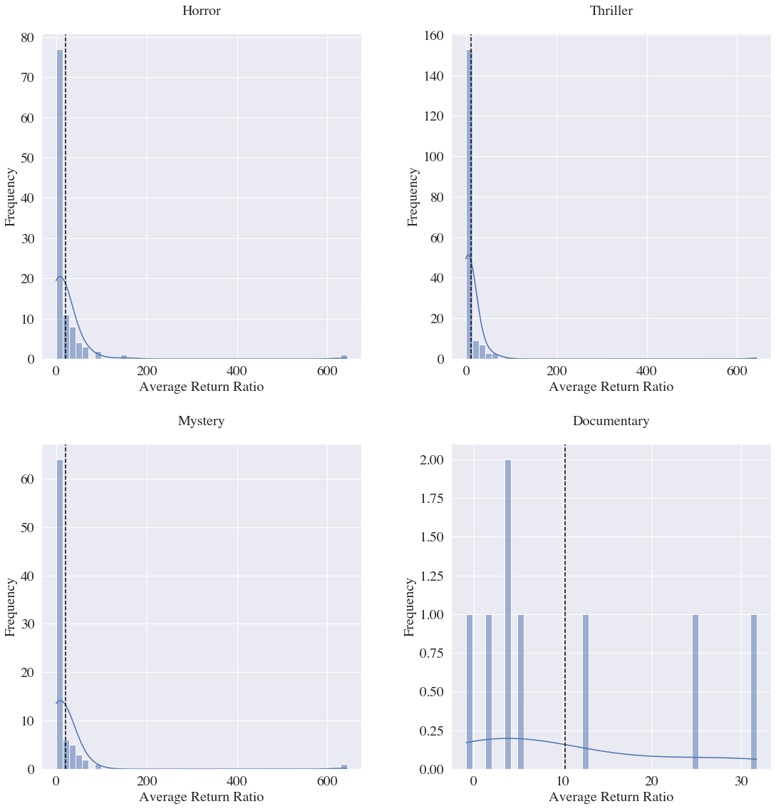
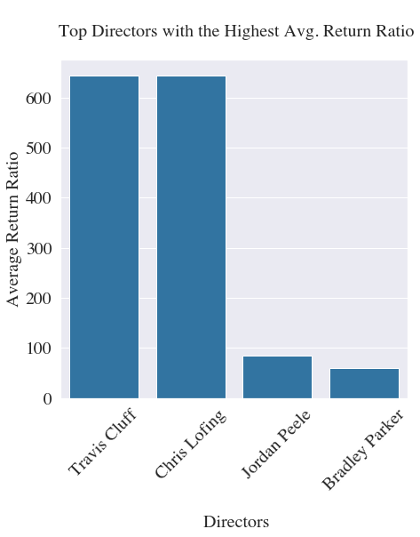
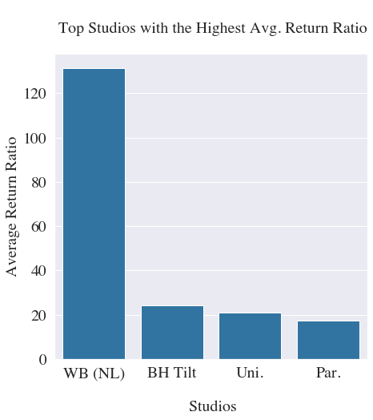
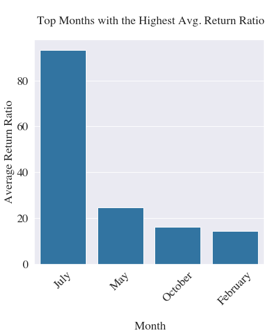
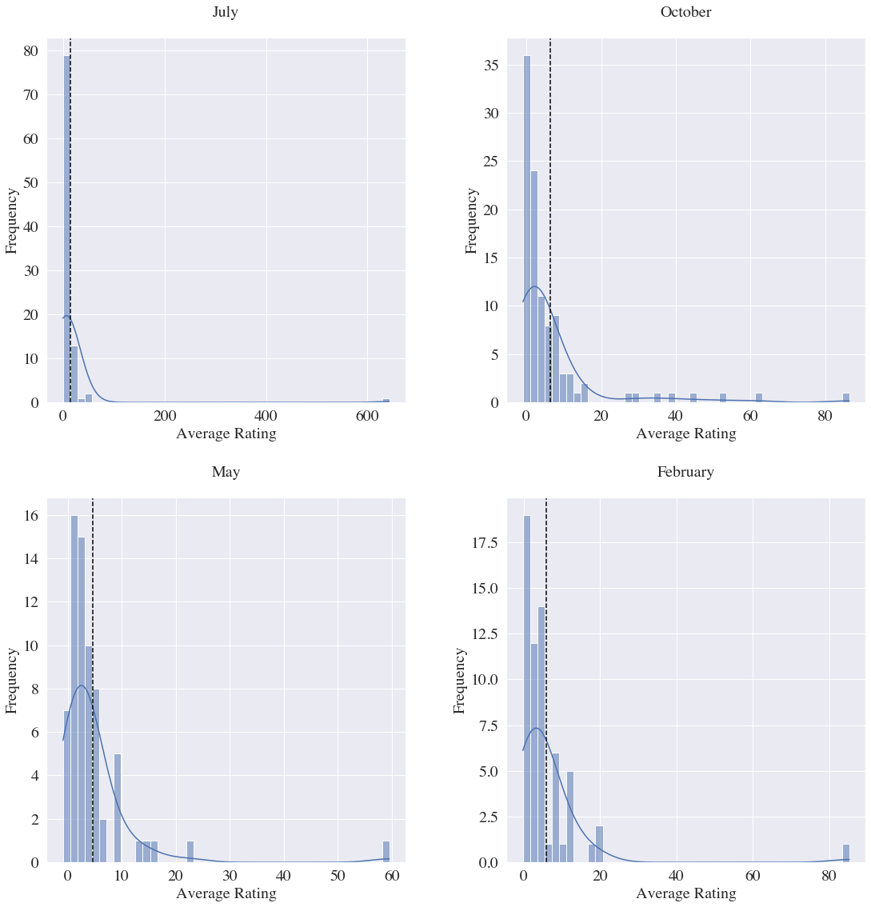

# Phase 1 Project Description


# Project Goal:

In this work, we are trying to come up with some (three or more) business plans to consider to enter film industry. The **goal** of this work is to come up with the best **genre**, **director**, **movie studio** and the **release month** for the movie by working with some available data. We define return ratio (shown by R here) calculated by R = (D + W - B)/B with D, W, B are respectively, domestic gross, worldwide gross, production budgets and we consider highest mean of return ratio as a metric to use to obtain the results. 


# Data

The data we use contains information about different movies. These data frames contain information on name of the movies, production budgets, domestic and worldwide grosses, directors, genres, release date, rating etc.


# Results

## Selecting a Genre

By performing some analysis we find that genres as shown in the next figure:





The histogram of these genres are shown below:




Since Horror and Mystry genres both almost have equal average return ratio, we will check which one has the higher average rating. Then we pick the one with the higher average rating. After performing some analysis, we pick Mystry as the main genre.

## Selecting a Director

In the selected genre, we try to find a director whose movies have the highest average return ratio. The results are shown below





We see that Travis Cluff's movies have as equal average return ratio as the works of Chris Lofing. Now we check whose work gained the higher average rating. We see that both works have again equal average rating. Now we check the total number of votes to select based on. But, again there are equal number of votes. So we would suggest to work with either directors. 

## Selecting a Studio

By performing analysis we see that WB (NL) has made movies in the selected genre with a higher average return ratio. So collaboration with this studio would be suggested. The result of the analysis is shown below. 



## Selecting a Release Month

We would recommend to consider July as the month of the release. The results of the analysis are shown below





The histogram of the distribution of data is shown below




# Conclusion and Suggestions:

In this report, we used highest mean of the return ratio as a metric to find the genre. Then we found the name of the director and the studio who have made movies in the chosen genre with the highest mean of the return ratio as well. The results of this report are as follows:

1. **Recommended Genre**.  After analyzing available data, we concluded that `Mystery` has the highest mean of return ratio among all other genres. Therefore, we recommend to choose `Mystery` as the genre to make a movie.

2. **Recommended Director**. After choosing `Mystery` as the genre of the movie, we did analyze the data and we realized that `Chris Lofing` and`Travis Cluff` have made movies as a director with the highest mean of return ratio. Therefore, we recommend to choose either `Chris Lofing` or `Travis Cluff`as the director of their movie. 

3. **Recommended Month of Release**. Considering that the `Mystery` as the genre of the movie, we concluded that movies released in `July` have the highest mean of return ratio. Therefore, we would recommend to release their movie in `July`.

4. **Recommended Studio**. From analyzing movies within `Mystery` genre, we concluded that `Mystery` movies made by studio `WB (NL)` have the highest mean of return ratio. Therefore, we recommend to work with `WB (NL)` for making a movie.


# Next Steps

The next steps we would recommend to consider for achieving their goals are:

1. **Selecting Writers and Actors and Actresses**.  We would recommend to do the same analysis to find the best writers, actors and actresses for their movie.


2. **Selecting Production Budget**. We recommend to select production budget to consider to make a movie by analyzing available data.


# Repository Structure

```
├── Images: Images for README
├── Notebooks: Modeling Notebooks
├── PDFs: PDF files of the notebooks and Presentation
├── Data : data used for modeling
├── README.md : project information and repository structure
```
